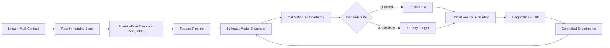

# Cassandra Architecture Quick Reference

## Ownership boundaries
- Deterministic services: identity, timestamps, snapshots, grading, audits.
- Statistical services: forecasts, uncertainty, calibration, ranking.
- Language AI: explanations and developer assistance grounded in stored facts.
- Human operator: approval, policy changes, model promotion and incident decisions.
